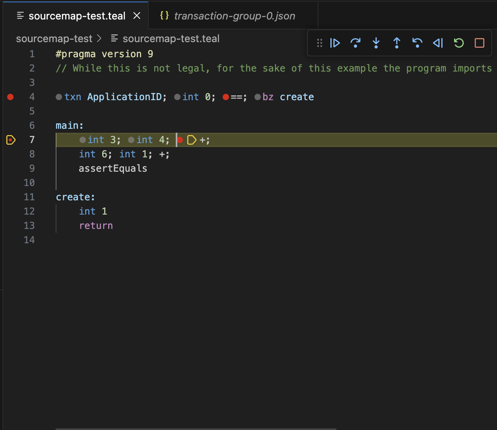
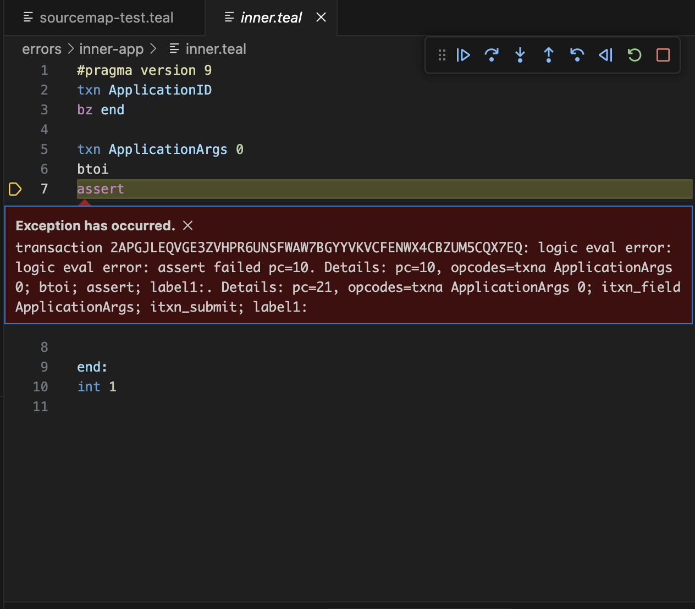

# Features

This document describes features that the AVM debugger supports.

Screenshots and the exact features are based on the VS Code client.

## View transaction groups being debugged

Every execution starts with a top level transaction group.

## Step into program executions

Both LogicSig and application programs associated with transactions can be stepped into. Source maps
are used to show the original source code.

## Step into inner transactions

If an application spawns an inner transaction, the debugger can step into it as well.

Additionally, the entire call stack can be seen, showing the depth of the inner transaction or inner
application being executed. Each frame of the call stack can be inspected to view the higher level
state.

## Step-by-step debugging

The debugger supports step into, over, out, and back. Yes, you can step back!

## Breakpoint support

Breakpoints can be set in program source files. The debugger will pause when code corresponding to a
breakpoint is about to be executed. Since multiple opcodes can be in a single line of source code,
breakpoints can be set on specific columns.

## Error reporting

Execution errors will be reported by the debugger. Since any error stops the execution of a
transaction group, the debugger will not allow you to advance after an error. You can however step
backwards to inspect what happened prior to the error.

## Inspect program state

The debugger allows you to inspect the state of the program being debugged. This includes the PC
(program counter), stack, and scratch space.

Byte arrays can be displayed in a variety of formats, including base64, hex, and UTF-8.

Additionally, specific values can be added to the watch list.

Since values relative to the top of the stack are often important, negative indexing is supported to
look up values relative to the top of the stack.

## Inspect application state

The debugger also allows you to inspect and watch any available application state from the
execution. Such state includes application boxes, global, and local state.

